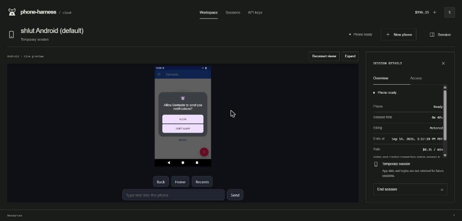
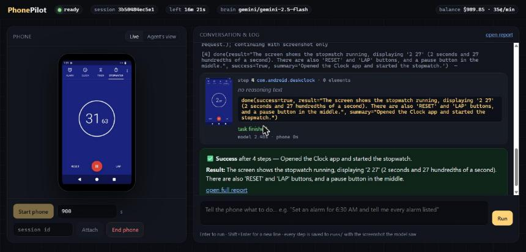

# PhonePilot

A general phone agent on **Phone Harness Cloud**: give it a sentence, it drives
a real cloud Android phone until the job is done and shows its work.

```
$ phonepilot run "Open the Clock app and set an alarm for 6:30 AM. Then tell me what alarms are listed."
created session 5d7008187bb9 (timeout 1200s); provisioning…
session 5d7008187bb9 ready after 137s: screen (720, 1280), 17 ops
[1] launch_app(package='com.android.deskclock')  — The task requires me to open the Clock app.
    -> Launched com.android.deskclock. Screen changed (97% of pixels).
[2] tap(element=2)  — 'ALARM' is a clickable option to navigate to the alarm section.
    -> Tapped [2] 'Alarm' at (80,120). Screen changed (8% of pixels).
[3] tap(element=20)  — The floating action button with a plus sign is used to add a new alarm.
[4] tap(element=17)  — Setting the hour to 6.
[5] tap(element=18)  — Setting the minutes to 30.
[6] tap(element=20)  — AM is selected. Now I need to confirm by tapping OK.
[7] tap(element=22)  — The alarm was set for 6:30 PM instead of AM. I need to edit the alarm to change it to AM.
…
[12] done(success=True, result='The listed alarms are: 6:30 AM, 8:30 AM, and 9:00 AM.')

SUCCESS after 12 steps: Successfully opened the Clock app and set an alarm for 6:30 AM.
Result: The listed alarms are: 6:30 AM, 8:30 AM, and 9:00 AM.
trace: runs\20260914-124223-open-the-clock-app-and-set-an-alarm-for-\report.html
```

(Real output from session `5d7008187bb9`; step 7 is the agent noticing its own
mistake from the verify screenshot and fixing it.)

Every run leaves a folder with each step's screenshot (with the element marks
the model saw), the model's one-line reasoning, the action, and what the phone
did in response — as `trace.jsonl`, a self-contained `report.html`, and
optionally an mp4. While it runs you can watch the same phone in the Phone
Harness dashboard's live viewer:



## Setup

Requirements: Python 3.11+, a Phone Harness Cloud API key, and one model key
(Anthropic or Gemini). `ffmpeg` on PATH only if you want `phonepilot video`.

```bash
git clone https://github.com/ShryukGrandhi/phonepilot && cd phonepilot
python -m venv .venv && . .venv/bin/activate        # Windows: .venv\Scripts\activate
pip install -e ".[dev]"
cp .env.example .env                                # then fill in the keys
```

`.env`:

```
PHONE_HARNESS_API_KEY=pck_…
ANTHROPIC_API_KEY=sk-ant-…      # preferred; uses claude-sonnet-5 by default
GEMINI_API_KEY=AIza…            # or this; uses gemini-2.5-flash by default
PHONEPILOT_BRAIN=anthropic      # optional: force a provider
PHONEPILOT_MODEL=               # optional: override the model id
```

Check the wiring without spending phone minutes:

```bash
phonepilot account        # balance, price per minute, session slots
pytest                    # 62 offline tests against a fake of the cloud API
```

## Usage

### Browser UI

```bash
phonepilot web            # opens http://127.0.0.1:8765
```

Left: the phone, live (the page polls the Cloud API's `frame.png` snapshot
about once a second) with a toggle to see the exact marked screenshot the
model saw on the last step. Right: a chat box and a streaming log of every
step (reasoning, action, verified outcome, thumbnail). Buttons start / attach /
end the phone; a Stop button cancels a running task after its current step.
The server is stdlib `http.server` + Server-Sent Events, no extra
dependencies; all phone control still goes through the Cloud API.



### Multi-user service

```bash
export PHONEPILOT_MASTER_KEY=$(phonepilot serve --generate-master-key)
phonepilot serve --port 8080 --data ./data       # or: docker compose up -d --build
```

Same page as `web`, plus accounts. Invite-only signup (first account is
admin), each user pastes their own Phone Harness + model keys in Settings
(encrypted at rest, never shown again), and gets their own phone, event
stream, run history and quotas. Two users can never see each other's phone,
frames, steps, or files; `docs/DEPLOY.md` spells out every isolation
mechanism and the deployment (Docker + Caddy TLS).

### Command line

```bash
# one task on a fresh phone; the phone is ended when the run finishes
phonepilot run "Open Settings and turn on the dark theme"

# keep the phone for more tasks (provisioning is ~2 min, so reuse pays off)
phonepilot run "Set an alarm for 6:30 AM on weekdays" --keep
phonepilot run "Now delete that alarm" --session 5d7008187bb9

# interactive: many instructions on one phone
phonepilot chat
phone (1180s left) › open the clock app and start a stopwatch
phone (1102s left) › /shot            # save shot.png
phone (1102s left) › /viewer          # live viewer URL for the dashboard
phone (1102s left) › /end

# plumbing
phonepilot start                       # provision, print the session id
phonepilot sessions                    # what is running
phonepilot shot SID out.png --marks    # screenshot with numbered elements
phonepilot op SID input.tap x=360 y=640
phonepilot op SID tree
phonepilot end SID
phonepilot history                     # finished sessions and cost

# after a run
phonepilot report runs/<run>           # open report.html
phonepilot video  runs/<run>           # render demo.mp4 (ffmpeg)

# the demo: one phone, four tasks, one stitched video
bash scripts/demo.sh                   # or: bash scripts/demo.sh my_tasks.txt
python scripts/make_demo_video.py runs/demo-<stamp> --out docs/demo.mp4
```

Flags for `run`/`chat`/`web`: `--brain {anthropic,gemini}`, `--model`,
`--max-steps` (default 25), `--timeout` (new session lifetime, default 900 s),
`--session`, `--keep`, `--runs-dir`, `--transport {http,adb}`.

### Two transports: Cloud API ops or stock adb

```bash
phonepilot run "…" --transport http   # default: POST /sessions/{id}/op for every action
phonepilot run "…" --transport adb    # register adb's key via POST /sessions/{id}/adb, then adb connect
```

Both drive the same agent loop; only the phone object differs
(`device.Device` vs `adb.AdbDevice`, same method surface). The ADB transport
needs Android platform-tools on PATH and gives you what the HTTP vocabulary
deliberately lacks: `shell()`, `grant()` (pre-grant runtime permissions),
`logcat()`, and a faster screenshot (`screencap -p` ≈ 0.8 s vs
`screen.capture` ≈ 2 s). Measured on session `4bd38736221c`:

| op | HTTP ops | adb |
|---|---|---|
| screenshot | 2.0 s | 0.8 s |
| hierarchy | 1.5–5 s (`tree`) | 2.5 s (`uiautomator dump`) |
| tap | 0.5 s | 0.13 s |
| launch app | 2.5 s | 1.2–2.5 s |
| foreground app | 0.5 s | 0.15 s |

The live `/adb` endpoint currently returns a direct ADB-over-TCP endpoint
(`transport: "adb"`), not the SSH tunnel the docs describe; the client handles
both shapes (see NOTES.md).

## How it works

```
                 ┌──────────────┐  Observation   ┌───────────┐
   screenshot ─▶ │              │ ─────────────▶ │           │
   tree       ─▶ │   observe    │  numbered      │   brain   │ ── one tool call ──▶ execute on Device
   current app─▶ │              │  elements +    │ (Claude / │                         │
                 └──────────────┘  marked image  │  Gemini)  │ ◀── feedback ───────────┘
                        ▲                        └───────────┘   "Tapped [7] 'Save'.
                        │                                         Screen changed."
                        └───────── the verify capture becomes the next observation
```

`src/phonepilot/`

| module | role |
|---|---|
| `cloud.py` | typed client for the Cloud API: sessions, `/op`, snapshot, viewer, account, history, APK, ADB. One request funnel, status → typed exceptions, retries only on reads and keyed creates. |
| `device.py` | the phone as an object: `tap`, `scroll`/`swipe`, `type_text`, `launch`, `tree()`, `screenshot()`, ASCII sanitising, frame diffing. |
| `observe.py` | picks actionable accessibility nodes, numbers them in reading order, draws the numbers on the screenshot (set-of-mark). |
| `brain/` | the model contract (`base.py`: tool schema, system prompt, action validation) and two adapters (`anthropic.py`, `gemini.py`) that keep their own message history and prune old screenshots. |
| `agent.py` | the loop: observe → decide → act → verify; repeat-without-effect nudges; step and deadline budgets; always records the run. |
| `sessions.py` | acquire/reuse/release a phone, ends what it created even on crash. |
| `trace.py`, `video.py` | run folder, `report.html`, mp4 rendering. |
| `adb.py` | the ADB transport: registers a key via `POST /sessions/{id}/adb`, connects stock adb, and mirrors `Device` over `input`/`screencap`/`uiautomator`, plus `shell`/`grant`/`logcat`. |
| `web/` | local browser UI: `server.py` (state machine, SSE hub, frame proxy, run-file serving) and `index.html`. |
| `service/` | multi-user service: `store.py` (SQLite), `auth.py` (scrypt, cookie sessions, invites), `secrets.py` (Fernet), `runtime.py` (per-user runtime + quotas), `app.py` (auth-scoped routes, CSRF, security headers). |
| `cli.py` | `phonepilot` commands. |

## Design decisions

**Tap by element number, not by pixel.** The model is shown the accessibility
tree as `[7] Button text='Save' @(582,1150)` and the same `7` drawn on the
screenshot. `tap(element=7)` hits the node's exact center. Pixel-guessing from a
downscaled image is where most vision agents lose; on this phone the tree is
reliable for stock apps, so the screenshot is for *understanding* and the tree
is for *aiming*. `tap_xy` stays available for custom-drawn UI.

**Verify every action, and say so to the model.** After each action the agent
takes a fresh `screen.capture`, diffs it against the pre-action frame, and
tells the model "Screen changed" or "Screen did NOT change (possible no-op)".
Three identical no-op actions in a row trigger an explicit nudge. This is the
cheapest reliability win I found: without it, models happily tap the same dead
spot five times.

**One capture per step.** The verify frame is reused as the next observation's
image, so a step costs one `screen.capture` (~2 s) plus one `tree` (~1.5–5 s),
not two captures. I use `screen.capture` rather than the cheaper `frame.png`
because the snapshot endpoint is coalesced (≤1 capture / 2 s) and can hand back
the *pre-action* frame — see NOTES.md.

**Provider-neutral tool vocabulary.** Eleven tools (`tap`, `tap_xy`,
`long_press`, `type_text`, `press_key`, `scroll`, `swipe`, `launch_app`,
`navigate`, `wait`, `done`) are defined once as JSON schema and translated into
Anthropic tool-use and Gemini function declarations. Every tool carries a
`reason` string so the trace has the model's one-line rationale even when a
provider returns no free text alongside a forced tool call.

**`scroll` is content-direction, `swipe` is finger-direction.** `scroll("down")`
means "show me what is further down" (finger moves up); `swipe("up")` means the
thumb moves up (next item in a feed). Both exist because English uses both,
and the phone-harness helper library made the same call.

**Bounded context.** Only the last 3 screenshots stay in the model's context;
older turns keep their text and tool results but the image is replaced with a
placeholder. Runs of 20+ steps stay fast and cheap.

**Budgets everywhere.** Step cap, session deadline (`expires_at` from the API)
with a safety margin, and a session lease that ends the phone in a `finally`.
Runs also record an estimated phone-time cost from `/me`'s
`price_cents_per_minute`.

**Sanitise text, don't fail.** `input.text` accepts printable ASCII only and
rejects a literal `%s`. `Device.type_text` folds accents (é→e), maps smart
quotes/dashes, drops the rest, and splits `%s` into two sends, then reports the
exact string that was typed back to the model.

**Never retry a phone op.** Ops are serialized and not idempotent server-side
(a retried tap is a second tap). The client retries only GETs and keyed
session creates.

## Results

Demo session `2d136f1b0934`, one phone, four tasks back to back, Gemini 2.5
Flash. Traces with every screenshot are in `docs/runs/`; the stitched video is
`docs/demo.mp4`.

| task | steps | wall | outcome |
|---|---|---|---|
| Add contact Grace Hopper (555-0142), confirm in list | 9 | 90 s | ✅ handled the first-run permission dialog, went back to the list to verify |
| Set a 6:30 AM alarm, list all alarms | 11 | 114 s | ✅ picker defaulted to PM; agent caught it on the verify frame and fixed it |
| Read Android version + device name | 8 | 96 s | ✅ "Android 15, redroid15_arm64" |
| Order a pizza from DoorDash (no Play Store) | 12 | ~150 s | ❌ by design: `done(success=false)` with the blocking reason |

The dev session before it (`5d7008187bb9`) ran the same three positive tasks
at 8 / 12 / 12 steps, all successful; the one thing that changed between the
two sessions was the per-step verification (see NOTES.md for the lessons).
Phone time for all seven runs: about $5.

## Testing

`pytest` runs 62 offline tests in under 4 s: the cloud client against an
in-memory fake of the service (`tests/conftest.py`), the device wrapper, element
selection and marking, the agent loop with a scripted brain (happy path, bad
element, no-op nudges, step cap, deadline, phone refusals, brain crash), the
session lease, and both model adapters with stubbed SDK clients (tool-result
plumbing and image pruning). Live runs against the real API are what the
`runs/` folder and the demo video document.

## Limits and known gaps

- The phone is a stock AOSP image (Android 15, `redroid15_arm64`): no Google
  services, no Play Store, no Chrome, no SIM. Tasks needing those end with
  `success=false` and a reason.
- Every live run so far used Gemini 2.5 Flash. The Anthropic adapter is
  unit-tested against a stubbed SDK but has not driven a phone yet (no API key
  on the build machine).
- Typing is ASCII-only (platform limit; see NOTES.md).
- Apps with custom-drawn UI (games, some web views) expose few accessibility
  nodes; the agent falls back to `tap_xy` from the screenshot, which is less
  reliable.
- One task at a time per phone. Ops are serialized per phone by the service.

## License

MIT.
